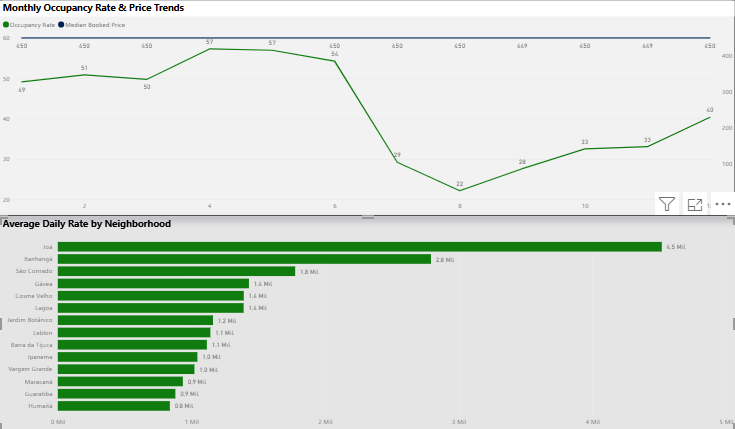

# rio-airbnb-analytics
Data analysis and Power BI dashboard for Rio de Janeiro Airbnb market trends
# 📊 Rio de Janeiro Airbnb Market & Seasonality Analysis

## About the Project & Motivation
As someone based in Brazil, I've always been fascinated by how tourism surges impact our major economic hubs. For this project, I wanted to dive deep into the short-term rental market in **Rio de Janeiro**—one of Latin America's top travel destinations. 

Using Power BI, I built this dashboard to uncover real-world market dynamics, focusing on monthly seasonality, occupancy fluctuations, and average daily rates (ADR) across different neighborhoods.

---

## 📈 Dashboard Preview


---

## 🛠️ Tech Stack & Skills Demonstrated
* **Tool:** Power BI Desktop
* **Data Transformation & Modeling:** Data cleaning, custom schema structures, and measure development.
* **DAX (Data Analysis Expressions):** Created clean, localized aggregation measures (`AVERAGE`) for metrics like Occupancy Rate, Median Booked Price, and Average Daily Rate.
* **Data Visualization & UX:** Applied professional formatting principles, high-contrast typography, custom card effects, and internationalized localization (English UI/UX).

---

## 📊 Key Insights & Findings
1. **Premium Neighborhoods Lead Pricing:** High-end coastal and luxury regions like **Joá** and **Itanhangá** command the highest Average Daily Rates (ADR), significantly outperforming the city baseline due to exclusive properties and high-demand tourism profiles.
2. **The Copacabana Anomaly:** Surprisingly, **Copacabana**—Rio's most iconic global postcard and high-density tourist hub—did not make the top 15 list of neighborhood pricing metrics analyzed in this specific scope, highlighting a fascinating concentration effect in other micro-regions.
3. **Counter-Intuitive Seasonality Peak:** While Rio de Janeiro's famous Carnival drives massive tourism spikes in February and March, the data reveals that actual occupancy and stay peaks occur later in **April and May**, pointing to extended shoulder-season preferences or remote work tourism trends.
4. **Micro-Price Fluctuations:** The analysis uncovered striking stability and minute, cent-level price variations across baseline bookings, proving a high degree of automated or rigid pricing strategies among hosts during specific periods.

---

## 📂 Repository Structure
```text
├── 01_bairros_precos.csv          # Neighborhood pricing dataset
├── 02_sazonalidade_completa.csv   # Seasonality and occupancy dataset
├── rio_airbnb_dashboard.pbix      # Power BI source file
└── dashboard-preview.png          # Dashboard screenshot

---

## Author
**Igor Cunha**  
*Transitioning Data Analyst | SQL, Python, Power BI*  
[LinkedIn Profile](https://www.linkedin.com/in/igor-antunesc/) | [GitHub Portfolio](https://github.com/igor-antunesc)
